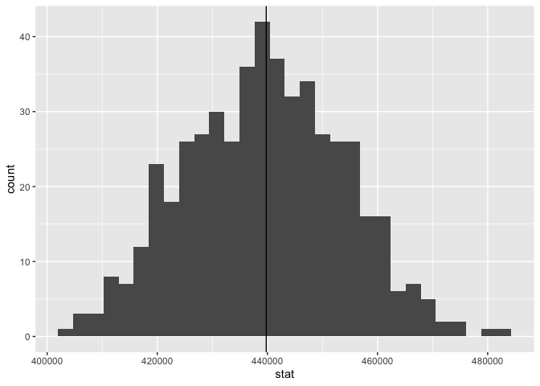
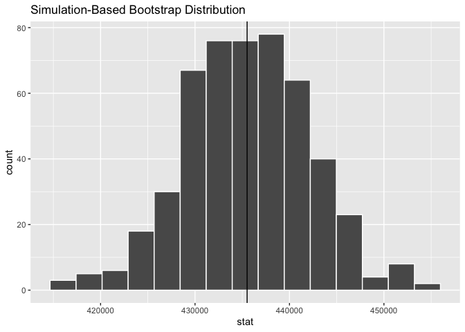
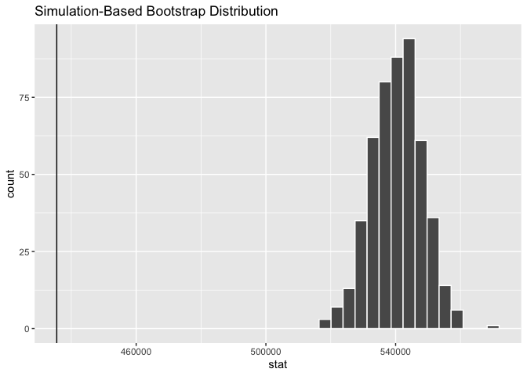
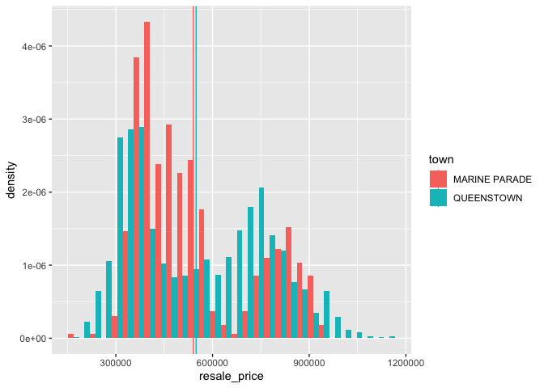
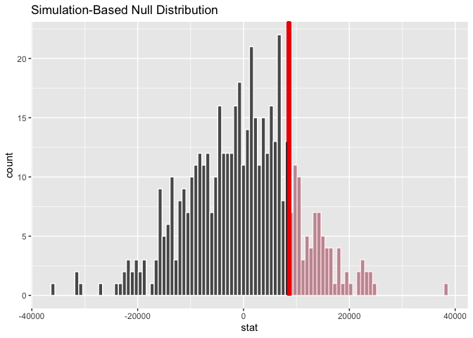

Week 4 Lab Practice
================
Jeanette Choong
2/18/2020

``` r
library(tidyverse)
```

# 4.2 Sampling resale transactions

``` r
sales <- readRDS(here::here("data/sales.rds"))

mu <- sales %>% 
  summarize(stat = mean(resale_price))

mu
```

    ## # A tibble: 1 x 1
    ##      stat
    ##     <dbl>
    ## 1 439793.

``` r
sales %>% 
  sample_n(100) %>% 
  summarize(stat = mean(resale_price))
```

    ## # A tibble: 1 x 1
    ##      stat
    ##     <dbl>
    ## 1 438340.

``` r
sample_mean <- function(data, size = 100) {
  data %>% 
    sample_n(size) %>% 
    summarize(stat = mean(resale_price))
}

sampled_means <- rerun(500, sample_mean(sales)) %>% bind_rows()
```

What does the sampled\_means table represent?

``` r
sampled_means %>% 
  ggplot(aes(x = stat)) + geom_histogram() +
  geom_vline(xintercept=mu$stat)
```

    ## `stat_bin()` using `bins = 30`. Pick better value with `binwidth`.

<!-- --> \# 4.3
Confidence Intervals

``` r
sales_sample <- sales %>%
  sample_n(500)
```

``` r
x_bar <- sales_sample %>% 
  summarize(stat = mean(resale_price))

x_bar
```

    ## # A tibble: 1 x 1
    ##      stat
    ##     <dbl>
    ## 1 435515.

``` r
library(infer)
```

``` r
sales_sample %>% 
  specify(response = resale_price) %>% 
  calculate(stat = "mean")
```

    ## # A tibble: 1 x 1
    ##      stat
    ##     <dbl>
    ## 1 435515.

## 4.3.1 Bootstrapping

We can use this same procedure but introduce one more step: generate.
This will generate a ‘bootstrapped’ sample. A bootstrap procedure simply
takes a sample that is equally sized to the entire dataset (79,100 rows
in this case) and it specifcally takes this sample with replacement.
This means that we copy one observation from our dataset and add it to
the sample but we do not remove this observation from the dataset. We
keep doing this until our sample is equal in size to our dataset (see
Burt Chapter 10.7 for an additional explanation).

``` r
bootstrapped_resale_price <-sales_sample %>% 
  specify(response = resale_price) %>% 
  generate(reps = 500) %>% 
  calculate(stat = "mean")
```

``` r
bootstrapped_resale_price %>% 
  visualise() + 
  geom_vline(xintercept = x_bar$stat)
```

<!-- -->

# 4.3.2 Confidence intervals

``` r
bootstrapped_resale_price %>% 
  get_ci()
```

    ## # A tibble: 1 x 2
    ##    `2.5%` `97.5%`
    ##     <dbl>   <dbl>
    ## 1 422471. 448245.

``` r
bootstrapped_resale_price %>% 
get_ci(level = 0.98)
```

    ## # A tibble: 1 x 2
    ##      `1%`   `99%`
    ##     <dbl>   <dbl>
    ## 1 418935. 451611.

## 4.3.3 Confidence intervals for a subset

For example, let’s say you have been asked to answer the question: ‘what
is the average HDB flat price in Marine Parade?’.

``` r
x_bar_mp <- sales %>% 
  filter(town == "MARINE PARADE") %>% 
  summarize(stat = mean(resale_price))

x_bar_mp
```

    ## # A tibble: 1 x 1
    ##      stat
    ##     <dbl>
    ## 1 540409.

Based on this initial mean, you could answer that the average price is
about $540,400. But if you look at the number of transactions this is
based on (only 485\!) you might feel a bit less confident. Try to use
the previous infer methods (specify, generate) to calculate a 95%
confidence interval around that mean. Try to answer both through a
numerical summary as well as a visualization.

``` r
# get bootstrapped sample for MP
bootstrapped_MP<-sales %>% 
  filter(town == "MARINE PARADE") %>% 
  specify(response = resale_price) %>% 
  generate(reps = 500) %>%
  calculate(stat = "mean")
```

``` r
bootstrapped_MP %>% 
  visualise() + geom_vline(xintercept = x_bar$stat)
```

<!-- -->

``` r
bootstrapped_MP %>% 
  get_ci()
```

    ## # A tibble: 1 x 2
    ##    `2.5%` `97.5%`
    ##     <dbl>   <dbl>
    ## 1 524666. 555268.

# 4.4 Comparing means between groups

``` r
town_means<- sales %>% 
  filter(town == "QUEENSTOWN" | town == "MARINE PARADE") %>% 
  group_by(town) %>% 
  summarise(mean = mean(resale_price))

town_means
```

    ## # A tibble: 2 x 2
    ##   town             mean
    ##   <chr>           <dbl>
    ## 1 MARINE PARADE 540409.
    ## 2 QUEENSTOWN    549037.

``` r
ggplot() + 
  geom_histogram(
    data = sales %>% 
      filter(town == "QUEENSTOWN" | town =="MARINE PARADE"), mapping = aes(x = resale_price, y =..density.., group=town, fill = town),  position = position_dodge())+
  geom_vline(
    data=town_means, 
    mapping=aes(xintercept = mean, group = town, color = town)
  )
```

    ## `stat_bin()` using `bins = 30`. Pick better value with `binwidth`.

<!-- -->

``` r
bootstrapped_resale_price_QT <- sales %>% 
  filter(town == "QUEENSTOWN") %>% 
  specify(response = resale_price) %>% 
  generate(reps = 100) %>% 
  calculate(stat = "mean")
```

    ## Setting `type = "bootstrap"` in `generate()`.

``` r
bootstrapped_resale_price_QT %>% 
  get_ci()
```

    ## # A tibble: 1 x 2
    ##    `2.5%` `97.5%`
    ##     <dbl>   <dbl>
    ## 1 539480. 557134.

You obtained the confidence interval for the mean resale price of Marine
Parade above, in Section 4.3.3. Do the confidence intervals overlap?
What do you think overlapping confidence intervals indicate about the
significant difference between the two means? - note not to assume there
is no significant difference just because they overlap.

``` r
mean_diff <- sales %>% 
  filter(town == "MARINE PARADE" | town == "QUEENSTOWN") %>% 
  specify(formula = resale_price ~ town) %>% 
  calculate(stat = "diff in means", order = c("QUEENSTOWN", "MARINE PARADE"))

mean_diff
```

    ## # A tibble: 1 x 1
    ##    stat
    ##   <dbl>
    ## 1 8628.

``` r
null_distribution <- sales %>% 
  filter(town == "MARINE PARADE" | town == "QUEENSTOWN") %>% 
  specify(formula = resale_price ~ town) %>% 
  hypothesize(null = "independence") %>% 
  generate(reps = 500, type = "permute") %>% 
  calculate(stat = "diff in means", order = c("QUEENSTOWN", "MARINE PARADE"))
```

``` r
null_distribution %>% 
  visualise(bins = 100) +
  shade_p_value(obs_stat = mean_diff, direction = "greater")
```

<!-- -->

``` r
null_distribution %>% 
  get_pvalue(obs_stat = mean_diff, direction = "greater")
```

    ## # A tibble: 1 x 1
    ##   p_value
    ##     <dbl>
    ## 1   0.174

``` r
sales %>% 
  filter(town == "MARINE PARADE" | town == "QUEENSTOWN") %>% 
  specify(formula = resale_price ~ town) %>% 
  # hypothesize(null = "independence") %>% # disable the null hypothesis
  generate(reps = 500, type = "bootstrap") %>% # set type to bootstrap
  calculate(stat = "diff in means", order = c("QUEENSTOWN", "MARINE PARADE")) %>% 
  get_ci()
```

    ## # A tibble: 1 x 2
    ##   `2.5%` `97.5%`
    ##    <dbl>   <dbl>
    ## 1 -8273.  28339.
