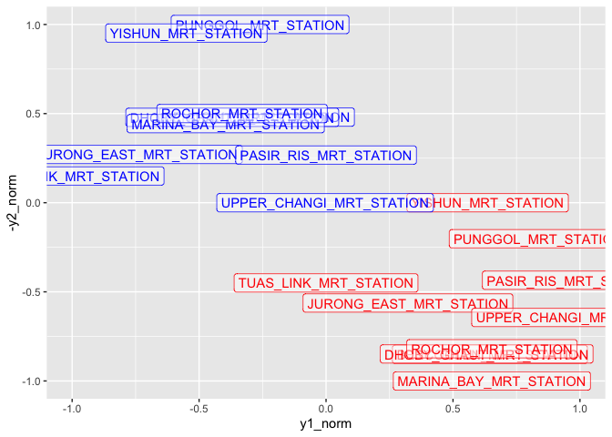
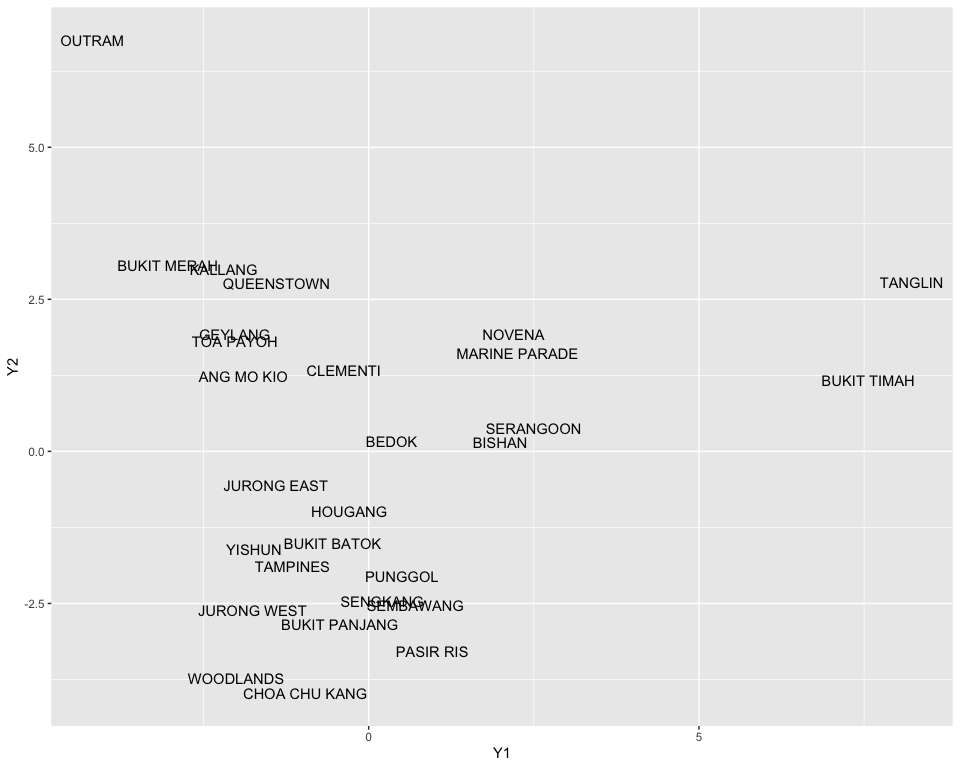

Session 6 - Multidimensional scaling
================
Jeanette Choong
2/27/2020

## 6.1 Introduction

In this session, we will start looking a the dimension reduction
strategies. In general, theses strategies are used to turn a dataset
with N dimensions into a dataset with N-x dimensions.

Why is this important? A very practical concern is that in our data-rish
urban environment of today, many of our datasets have many variables.
How can we make sense of a dataset where we have dozens and dozens of
variables for every single observation?

As it turns out, in many cases, our variables have certain degrees of
correlation: they share certain information (or variance in statistical
terms) with, potentially, fewer dimensions or variables.

We will see how this works in practice with two specific techniques: 1.
Multidimensional scaling (MDS) 2. Principal Components Analysis (PCA)

## 6.2 MDS of MRT stations

The goal of MDS is relatively straightforward on a conceptual level:
given a set of distances between objects, create a map (i.e. find the
position of each object) that displays the relative position of each
object correctly.

In mathematical terms, we are trying to minimise the stress between the
real or observed distances (d) and the distances in the MDS map (d-hat).

Let’s put this into practice by loading a dataset consisting of 10 MRT
stations in Singapore and the distance (as the crow flies, in meters)
between them. Note that the actual location of each station is NOT
included in this dataset.

``` r
library(tidyverse)
library(here)
```

``` r
station_distance <- tibble::tribble(
  ~STN_NAME, ~YISHUN_MRT_STATION, ~PASIR_RIS_MRT_STATION, ~JURONG_EAST_MRT_STATION, ~TUAS_LINK_MRT_STATION, ~BENCOOLEN_MRT_STATION, ~PUNGGOL_MRT_STATION, ~MARINA_BAY_MRT_STATION, ~DHOBY_GHAUT_MRT_STATION, ~ROCHOR_MRT_STATION, ~UPPER_CHANGI_MRT_STATION,
  "YISHUN_MRT_STATION", "0", "14165.8028309003", "14826.8234223324", "24144.58370996", "14539.8253530485", "7955.17551381608", "17097.0983148766", "14495.1289232166", "14014.7715236133", "17091.9107945143",
  "PASIR_RIS_MRT_STATION", "14165.8028309003", "0", "23451.9973340811", "34950.8745491473", "13721.3248153691", "6306.08987347808", "14983.0092441387", "14095.3770091796", "13209.4818715068", "3712.4090725179",
  "JURONG_EAST_MRT_STATION", "14826.8234223324", "23451.9973340811", "0", "11758.6400823558", "12613.5429467971", "19455.8643741636", "14047.8304857995", "12175.0907736314", "12676.1241992151", "24411.4671044188",
  "TUAS_LINK_MRT_STATION", "24144.58370996", "34950.8745491473", "11758.6400823558", "0", "24202.2573770791", "30351.6324743735", "25305.1676395598", "23749.9738806756", "24325.8635170677", "36124.0377992668",
  "BENCOOLEN_MRT_STATION", "14539.8253530485", "13721.3248153691", "12613.5429467971", "24202.2573770791", "0", "13024.8987292155", "2565.66801256045", "461.323513564845", "602.910926685915", "13240.7330980557",
  "PUNGGOL_MRT_STATION", "7955.17551381608", "6306.08987347808", "19455.8643741636", "30351.6324743735", "13024.8987292155", "0", "15129.4446906282", "13237.1986125019", "12423.6186258471", "9588.13908018742",
  "MARINA_BAY_MRT_STATION", "17097.0983148766", "14983.0092441387", "14047.8304857995", "25305.1676395598", "2565.66801256045", "15129.4446906282", "0", "2695.76728986719", "3084.57512743706", "13883.5893006481",
  "DHOBY_GHAUT_MRT_STATION", "14495.1289232166", "14095.3770091796", "12175.0907736314", "23749.9738806756", "461.323513564845", "13237.1986125019", "2695.76728986719", "0", "887.79255969772", "13673.2848886229",
  "ROCHOR_MRT_STATION", "14014.7715236133", "13209.4818715068", "12676.1241992151", "24325.8635170677", "602.910926685915", "12423.6186258471", "3084.57512743706", "887.79255969772", "0", "12836.5477607036",
  "UPPER_CHANGI_MRT_STATION", "17091.9107945143", "3712.4090725179", "24411.4671044188", "36124.0377992668", "13240.7330980557", "9588.13908018742", "13883.5893006481", "13673.2848886229", "12836.5477607036", "0"
)
## tibble creation code created with datapasta: very useful for quickly copying small datasets to/from R.
```

Let’s check what’s in there:

``` r
station_distance %>% head()
```

    ## # A tibble: 6 x 11
    ##   STN_NAME YISHUN_MRT_STAT… PASIR_RIS_MRT_S… JURONG_EAST_MRT… TUAS_LINK_MRT_S…
    ##   <chr>    <chr>            <chr>            <chr>            <chr>           
    ## 1 YISHUN_… 0                14165.8028309003 14826.8234223324 24144.58370996  
    ## 2 PASIR_R… 14165.8028309003 0                23451.9973340811 34950.8745491473
    ## 3 JURONG_… 14826.8234223324 23451.9973340811 0                11758.6400823558
    ## 4 TUAS_LI… 24144.58370996   34950.8745491473 11758.6400823558 0               
    ## 5 BENCOOL… 14539.8253530485 13721.3248153691 12613.5429467971 24202.2573770791
    ## 6 PUNGGOL… 7955.17551381608 6306.08987347808 19455.8643741636 30351.6324743735
    ## # … with 6 more variables: BENCOOLEN_MRT_STATION <chr>,
    ## #   PUNGGOL_MRT_STATION <chr>, MARINA_BAY_MRT_STATION <chr>,
    ## #   DHOBY_GHAUT_MRT_STATION <chr>, ROCHOR_MRT_STATION <chr>,
    ## #   UPPER_CHANGI_MRT_STATION <chr>

All our variables are of type `chr`, so we will need to change some of
them to numerical. Additionally, the first column is the name of the MRT
station. We want to use it as a “label” for the row, like we use column
names as labels for columns: this is what `column_to_rownames` does.

Once transformed, we can use the `cmdscale` function (available in base
R) to perform our MDS process. We convert out tibble to matrix first, as
that is the format that `cmdscale` is expecting.

``` r
# convert to matrix ensuring distances are numeric
station_distance_matrix <- station_distance %>%
  column_to_rownames(var = "STN_NAME") %>%
  mutate_all(as.numeric) %>%
  as.matrix()
```

``` r
# perform MDS
mds_station <- cmdscale(station_distance_matrix) %>%
  as_tibble() %>%
  rename(Y1 = V1, Y2 = V2)
```

    ## Warning: `as_tibble.matrix()` requires a matrix with column names or a `.name_repair` argument. Using compatibility `.name_repair`.
    ## This warning is displayed once per session.

``` r
# add station name to each position
mds_station <- station_distance %>%
  select(STN_NAME) %>%
  bind_cols(., mds_station)

mds_station
```

    ## # A tibble: 10 x 3
    ##    STN_NAME                       Y1     Y2
    ##    <chr>                       <dbl>  <dbl>
    ##  1 YISHUN_MRT_STATION           46.7 -9930.
    ##  2 PASIR_RIS_MRT_STATION     12108.  -2501.
    ##  3 JURONG_EAST_MRT_STATION  -11242.   -317.
    ##  4 TUAS_LINK_MRT_STATION    -22842.  -2243.
    ##  5 BENCOOLEN_MRT_STATION       371.   4606.
    ##  6 PUNGGOL_MRT_STATION        7213.  -6476.
    ##  7 MARINA_BAY_MRT_STATION      653.   7157.
    ##  8 DHOBY_GHAUT_MRT_STATION     -88.5  4565.
    ##  9 ROCHOR_MRT_STATION          650.   4072.
    ## 10 UPPER_CHANGI_MRT_STATION  13130.   1068.

Those coordinates are difficult to read, so let’s create a map:

``` r
ggplot(mds_station, aes(x = Y1, y = -Y2)) +
  geom_text(aes(label = STN_NAME))
```

<!-- -->

``` r
# the minus sign before Y2 is to correct the positions of the stations by flipping the data along the x-axis
```

If you know Singapore a little bit, you immediately recognize that the
stations are more or less in the correct position\! Not a bad result per
se. But what if we didn’t exactly know the ‘real’ location of each
station - how would we assess how well our MDS process has performed?
One way would be to compare the real distances with the predicted
distances. We can do this visually, as well as by calculating a stress
metric.

``` r
distance_pred <- cmdscale(station_distance_matrix) %>%
  dist(upper = T) %>%
  as.matrix()
distance <- station_distance_matrix

tibble(
  distance = as.vector(distance),
  distance_pred = as.vector(distance_pred)
) %>%
  ggplot(aes(x = distance, y = distance_pred)) + geom_point()
```

<!-- --> They all fall
in a line. E.g. if the distance is 10000, the reconstructed distance is
also around 10000. Means it’s pretty accurate.

``` r
mds_stress <- function(d, d_hat) {
  sqrt(
    sum((d - d_hat)^2) / sum(d^2)
  )
}

mds_stress(distance, distance_pred)
```

    ## [1] 2.447984e-15

The stress metric is very close to 0.

## 6.3 MDS with travel distance

The map we created in the previous section might seem quite trivial.
Afterall, if we already know the exact position of each MRT station, why
would we need to re-compute this position based on the distances between
MRT stations? In fact, the real power of MDS comes from the fact that
you can use ANY variable or indicator as the distance metric.

For example, we can look at the distance travelled by the trains instead
of geographical distance.

``` r
station_mrt_distance <- tibble::tribble(
  ~STN_NAME, ~BENCOOLEN_MRT_STATION, ~DHOBY_GHAUT_MRT_STATION, ~JURONG_EAST_MRT_STATION, ~MARINA_BAY_MRT_STATION, ~PASIR_RIS_MRT_STATION, ~PUNGGOL_MRT_STATION, ~ROCHOR_MRT_STATION, ~TUAS_LINK_MRT_STATION, ~UPPER_CHANGI_MRT_STATION, ~YISHUN_MRT_STATION,
  "BENCOOLEN_MRT_STATION", 0, 476, 2077, 660, 2347, 1975, 640, 3312, 1918, 2237,
  "DHOBY_GHAUT_MRT_STATION", 476, 0, 2018, 364, 1966, 1484, 287, 3253, 2243, 1837,
  "JURONG_EAST_MRT_STATION", 2641, 2001, 0, 1887, 3676, 3389, 2152, 1739, 3699, 2427,
  "MARINA_BAY_MRT_STATION", 754, 362, 1880, 0, 2164, 1933, 570, 3115, 2556, 2143,
  "PASIR_RIS_MRT_STATION", 2347, 1974, 3679, 2174, 0, 2582, 1825, 4914, 1452, 3755,
  "PUNGGOL_MRT_STATION", 1913, 1484, 3455, 1763, 2617, 0, 1475, 4690, 2622, 2222,
  "ROCHOR_MRT_STATION", 640, 382, 1937, 487, 1814, 1630, 0, 3172, 2081, 1826,
  "TUAS_LINK_MRT_STATION", 3875, 3186, 1738, 3121, 4910, 4574, 3464, 0, 5016, 3678,
  "UPPER_CHANGI_MRT_STATION", 1779, 2104, 3632, 2326, 1217, 3726, 1916, 4867, 0, 3814,
  "YISHUN_MRT_STATION", 2253, 1804, 2395, 2112, 3714, 2167, 1690, 3641, 4076, 0
)

station_mrt_distance %>%
  head()
```

    ## # A tibble: 6 x 11
    ##   STN_NAME BENCOOLEN_MRT_S… DHOBY_GHAUT_MRT… JURONG_EAST_MRT… MARINA_BAY_MRT_…
    ##   <chr>               <dbl>            <dbl>            <dbl>            <dbl>
    ## 1 BENCOOL…                0              476             2077              660
    ## 2 DHOBY_G…              476                0             2018              364
    ## 3 JURONG_…             2641             2001                0             1887
    ## 4 MARINA_…              754              362             1880                0
    ## 5 PASIR_R…             2347             1974             3679             2174
    ## 6 PUNGGOL…             1913             1484             3455             1763
    ## # … with 6 more variables: PASIR_RIS_MRT_STATION <dbl>,
    ## #   PUNGGOL_MRT_STATION <dbl>, ROCHOR_MRT_STATION <dbl>,
    ## #   TUAS_LINK_MRT_STATION <dbl>, UPPER_CHANGI_MRT_STATION <dbl>,
    ## #   YISHUN_MRT_STATION <dbl>

``` r
# convert to matrix
stn_mrt_dist_matrix <- station_mrt_distance %>% 
  column_to_rownames(var="STN_NAME") %>% 
  as.matrix()

# perform MDS
mds_mrt <- cmdscale(stn_mrt_dist_matrix) %>% 
  as_tibble() %>% 
  rename(Y1 = V1, Y2 = V2)

# add station name to each position
mds_mrt <- station_mrt_distance %>% 
  select(STN_NAME) %>% 
  bind_cols(., mds_mrt)

mds_mrt
```

    ## # A tibble: 10 x 3
    ##    STN_NAME                      Y1      Y2
    ##    <chr>                      <dbl>   <dbl>
    ##  1 BENCOOLEN_MRT_STATION     -568.     73.4
    ##  2 DHOBY_GHAUT_MRT_STATION   -100.     68.4
    ##  3 JURONG_EAST_MRT_STATION   1700.   -610. 
    ##  4 MARINA_BAY_MRT_STATION      24.2   -46.3
    ##  5 PASIR_RIS_MRT_STATION    -1881.   -622. 
    ##  6 PUNGGOL_MRT_STATION       -628.   1767. 
    ##  7 ROCHOR_MRT_STATION        -288.    138. 
    ##  8 TUAS_LINK_MRT_STATION     2939.  -1005. 
    ##  9 UPPER_CHANGI_MRT_STATION -1862.  -1493. 
    ## 10 YISHUN_MRT_STATION         771.   1609.

``` r
ggplot(mds_mrt, aes(x=-Y1, y=Y2)) + 
  geom_text(aes(label = STN_NAME))
```

<!-- -->

``` r
distance_pred_mrt <- cmdscale(stn_mrt_dist_matrix) %>% 
  dist(upper = T) %>% 
  as.matrix()

  distance_mrt <- stn_mrt_dist_matrix
  
tibble(
  distance_mrt = as.vector(distance_mrt), 
  distance_pred_mrt = as.vector(distance_pred_mrt)
) %>% 
  ggplot(aes(x = distance_mrt, y = distance_pred_mrt))+ geom_point()
```

<!-- -->

``` r
# calculate stress
mds_stress(distance_mrt, distance_pred_mrt)
```

    ## [1] 0.1052036

Potential reason for the difference in metric with the previous section:
Geographical vs train travel distance can be very different considering
they’re all on different MRT lines. Therefore it might take a longer
distance to travel from one point to another even though they are
geographically super close. (E.g. bencoolen and dhoby ghaut)

``` r
library(scales) # library for rescale function
```

    ## 
    ## Attaching package: 'scales'

    ## The following object is masked from 'package:purrr':
    ## 
    ##     discard

    ## The following object is masked from 'package:readr':
    ## 
    ##     col_factor

``` r
mds_mrt <- mds_mrt %>% 
  mutate(y1_norm = rescale(Y1), 
         y2_norm = rescale(Y2))

mds_station <-  mds_station %>% 
  mutate(y1_norm = rescale(Y1),
         y2_norm = rescale(Y2))


ggplot(mds_station, aes(x = y1_norm, y = -y2_norm)) + 
  geom_label(aes(label = STN_NAME), color = "red", fill = rgb(1,1,1,0.5))+
  geom_label(data = mds_mrt, aes(x=-y1_norm, y = y2_norm, label = STN_NAME), color = "blue", fill = rgb(1,1,1,0.5))
```

<!-- -->

## 6.4 MDS of Arbitrary Variables (2D)

In the previous section, you have explored the application of MDS to
distances (both geographically and travel time) between MRT stations.
While travel time distances might be interesting in and of itself, MDS
can be applied to any type of distance.

Furthermore, until now, we have only used two variables as input for our
distance calculations so we can’t really speak of dimension reduction as
of yet\!

In this section and next, we’ll mitigate that by analysing a dataset of
Singapore’ planning areas and their various characteristics.

``` r
planning_areas <- read_csv(here::here("data/planning_areas.csv"))
```

    ## Parsed with column specification:
    ## cols(
    ##   .default = col_double(),
    ##   planning_area = col_character()
    ## )

    ## See spec(...) for full column specifications.

``` r
glimpse(planning_areas)
```

    ## Observations: 28
    ## Variables: 22
    ## $ planning_area                          <chr> "ANG MO KIO", "BEDOK", "BISHAN…
    ## $ area_hdb                               <dbl> 0.0382151906, 0.0320619695, 0.…
    ## $ area_res                               <dbl> 0.0400515955, 0.0835754816, 0.…
    ## $ area_other                             <dbl> 0.05772511, 0.04450232, 0.0797…
    ## $ schools_secondary                      <dbl> 0.4303735, 0.4601258, 0.525008…
    ## $ hotel_rooms                            <dbl> 0.000000, 18.266994, 0.000000,…
    ## $ hh_income_lt_2000                      <dbl> 0.25920000, 0.20995671, 0.1588…
    ## $ hh_income_gt_17500                     <dbl> 0.1296000, 0.2012987, 0.263537…
    ## $ ethn_malays                            <dbl> 0.07472678, 0.15178602, 0.0414…
    ## $ ethn_indians                           <dbl> 0.08096355, 0.08666091, 0.0771…
    ## $ hh_1person                             <dbl> 0.16613419, 0.13636364, 0.0967…
    ## $ hh_5person_plus                        <dbl> 0.1900958, 0.2326840, 0.258064…
    ## $ age_0_9                                <dbl> 0.08268009, 0.08659488, 0.0855…
    ## $ age_10_19                              <dbl> 0.10076100, 0.10933941, 0.1128…
    ## $ age_gt_65                              <dbl> 0.16255650, 0.14550977, 0.1344…
    ## $ edu_no_qual_primary                    <dbl> 0.25653370, 0.19679849, 0.1365…
    ## $ edu_university                         <dbl> 0.2434663, 0.2961394, 0.372980…
    ## $ occupation_senior_manager_professional <dbl> 0.3218164, 0.3845642, 0.479757…
    ## $ occupation_cleaners_labourers_plant    <dbl> 0.18756170, 0.13439787, 0.0769…
    ## $ dwelling_1_2_room                      <dbl> 0.089456869, 0.043336945, 0.01…
    ## $ dwelling_condo_landed                  <dbl> 0.15814696, 0.34236186, 0.2913…
    ## $ status_unemployed                      <dbl> 0.02926209, 0.02542373, 0.0249…

Most of the variables are relatively self-descriptive. You should know
that all variables are relative (i.e. % relative to total population)
except two variables: `hotel_rooms` and `schools_secondary` are both
expressed in units per sq km. This isn’t so important now but it will
come back soon so do take note.

We will get started by applying MDS to only two variables in our
dataset: the % of households with income greater than $17.5k; and % of
area used by non-HDB residences. Both relate very much to economic
class.

You already know how to create a custom ‘economic class’ space and
position with each planning area within that space. this is what a
scatterplot does\!

``` r
ggplot(planning_areas, aes(area_res, hh_income_gt_17500)) + 
  geom_text(aes(label = planning_area))
```

<!-- -->

It is clear there is a relationship between the two variables but you
can also clearly see some specific ‘areas’ within the chart
(e.g. Tanglin + Bukit Timah; Novena + Bishan + Marine Parade + Bedok;
Serangoon). Let’s see if we can reproduce this plot through MDS as well.

To do so, we need to calculate distances betweeen each point and all
other points. As distance calculations in R generally operate on
matrices(AFAIK there are no `tidyverse` compatible libraries yet), we
convert to a matrix first, as we have done in the first two sections.

``` r
pln_area_matrix <- planning_areas %>% 
  select(area_res, hh_income_gt_17500) %>% 
  as.matrix()


pln_area_matrix %>% head()
```

    ##         area_res hh_income_gt_17500
    ## [1,] 0.040051596          0.1296000
    ## [2,] 0.083575482          0.2012987
    ## [3,] 0.055684550          0.2635379
    ## [4,] 0.017558208          0.1526196
    ## [5,] 0.003096563          0.1270417
    ## [6,] 0.017867289          0.1452785

Once we have a matrix, we can calculate distance with the `distances`
function from the library by the same name. It calculated the Euclidean
distance between each set of points (like in Pythagoras’ Theorem).

``` r
# Calculate Euclidean dist
library(distances)

pln_area_dist <- distances(pln_area_matrix) %>% 
  as.matrix()

pln_area_dist %>% head()
```

    ##            1          2          3           4          5           6         7
    ## 1 0.00000000 0.08387510 0.13484714 0.032184686 0.03704348 0.027165369 0.4044788
    ## 2 0.08387510 0.00000000 0.06820281 0.082023999 0.10950321 0.086347177 0.3274620
    ## 3 0.13484714 0.06820281 0.00000000 0.117288068 0.14627611 0.124158947 0.2700641
    ## 4 0.03218469 0.08202400 0.11728807 0.000000000 0.02938308 0.007347643 0.3867945
    ## 5 0.03704348 0.10950321 0.14627611 0.029383081 0.00000000 0.023468103 0.4152234
    ## 6 0.02716537 0.08634718 0.12415895 0.007347643 0.02346810 0.000000000 0.3938374
    ##            8          9          10         11          12         13
    ## 1 0.02983052 0.05521157 0.009743021 0.02865862 0.039625795 0.03985095
    ## 2 0.10363638 0.05440185 0.093012674 0.05537553 0.106882993 0.12194128
    ## 3 0.14290053 0.08280851 0.144576242 0.10829750 0.140872392 0.16525466
    ## 4 0.02563138 0.03470522 0.038703122 0.03531690 0.025252657 0.04832371
    ## 5 0.00723530 0.06402710 0.035987427 0.05714278 0.007240508 0.02258667
    ## 6 0.01883376 0.04139305 0.032559379 0.03631191 0.020656097 0.04120097
    ##            14         15         16          17         18         19
    ## 1 0.034893079 0.14937245 0.19204491 0.028481532 0.05751171 0.04020559
    ## 2 0.087459358 0.07029106 0.12205517 0.090219149 0.06929495 0.11875160
    ## 3 0.120923080 0.03196319 0.05728708 0.127404216 0.09003238 0.15845698
    ## 4 0.005650180 0.13751202 0.17305310 0.010132856 0.02965275 0.04118410
    ## 5 0.025353066 0.16689345 0.20148596 0.019700723 0.05693430 0.01292848
    ## 6 0.007796717 0.14375890 0.18012398 0.003873727 0.03699904 0.03455143
    ##           20         21          22         23         24        25          26
    ## 1 0.03136031 0.02701852 0.036362813 0.16015314 0.03391935 0.3600459 0.018353435
    ## 2 0.09748907 0.10364471 0.104059460 0.07855645 0.09521800 0.2852168 0.085759667
    ## 3 0.13401908 0.14483924 0.139231635 0.08933905 0.12984416 0.2252277 0.128198570
    ## 4 0.01689693 0.02792676 0.022830641 0.16052132 0.01346144 0.3411439 0.015060369
    ## 5 0.01250847 0.01053080 0.007272423 0.18798908 0.01643606 0.3692545 0.024548091
    ## 6 0.01115344 0.02075878 0.017721253 0.16489815 0.00959725 0.3482697 0.008927303
    ##           27         28
    ## 1 0.05511848 0.05492234
    ## 2 0.13854146 0.13874887
    ## 3 0.18313382 0.18524216
    ## 4 0.06618326 0.06888574
    ## 5 0.03923593 0.04319390
    ## 6 0.05908557 0.06165084

We can now use these distances in the same way as we used the distances
between MRT stations.

``` r
mds_planning_area <- cmdscale(pln_area_dist) %>% 
  as_tibble() %>% 
  rename(Y1 = V1, Y2 = V2)

mds_planning_area <- planning_areas %>% 
  select(planning_area) %>% 
  bind_cols(., mds_planning_area)

mds_planning_area %>% 
  head()
```

    ## # A tibble: 6 x 3
    ##   planning_area      Y1       Y2
    ##   <chr>           <dbl>    <dbl>
    ## 1 ANG MO KIO     0.0507  0.0197 
    ## 2 BEDOK         -0.0301  0.0424 
    ## 3 BISHAN        -0.0825 -0.00119
    ## 4 BUKIT BATOK    0.0345 -0.00814
    ## 5 BUKIT MERAH    0.0631 -0.0152 
    ## 6 BUKIT PANJANG  0.0415 -0.00588

``` r
ggplot(mds_planning_area, aes(x = -Y2, y = -Y1)) + 
  geom_text(aes(label = planning_area))
```

<!-- -->

### 6.4.1 Exercise

Is the resulting scatterplot a faithful reproduction of the original? -
not really. Some areas are jumbled up e.g. novena and bishan.

What could be the potential reasons? - relative vs absolute distances
(calculated here).

``` r
# Plotting of actual distance 

pln_dist_pred <- cmdscale(pln_area_dist) %>% # rmb to use pln_area_dist as there was a conversion step to dist
  dist(upper=T) %>% 
  as.matrix()

pln_dist <- pln_area_dist

tibble(
  pln_dist = as.vector(pln_dist), 
  pln_dist_pred = as.vector(pln_dist_pred)
) %>% 
  ggplot(aes(x = pln_dist, y = pln_dist_pred)) + 
  geom_point()
```

<!-- -->

``` r
mds_stress(pln_dist, pln_dist_pred)
```

    ## [1] 5.270684e-16

Stress close to 0. Weird?

## 6.5 MDS of arbitrary variables (more than 2D)

In the exact same way, we add additional variables to our MDS analysis.
All it takes is adding these variables to our original matrix.

For example, to add 3 additional variables related to economic class,
you could do:

``` r
pln_area_matrix <- planning_areas %>% 
  select(area_res, hh_income_gt_17500, edu_university, occupation_senior_manager_professional, status_unemployed) %>% 
  as.matrix()
```

Or include all variables except `planning_area`:

``` r
pln_area_matrix <- planning_areas %>% 
  select(-planning_area) %>% 
  as.matrix()
```

`distances` will calculate the Euclidean distances across as many
dimensions as you’d like. For n-dimentional space, (x,y,…, n).

``` r
pln_area_dist <- distances(pln_area_matrix) %>% 
  as.matrix()

mds_planning_area <- cmdscale(pln_area_dist) %>% 
  as_tibble() %>% 
  rename(Y1 = V1, Y2 = V2)

# add planning area name back

mds_planning_area <- planning_areas %>% 
  select(planning_area) %>% 
  bind_cols(., mds_planning_area)

ggplot(mds_planning_area, aes(x = Y1, y = Y2)) + 
  geom_text(aes(label = planning_area))
```

<!-- -->

One final issue to contend with is that not all our variables are on the
same scale.

While most are in relative percentages, the `hotel_room` variable is
measured in the number of rooms per sq km. In Outram, there are over
3000 rooms per sq km\! This dramatically affects our distances (and
distances are often an input for a variety of machine learning
techniques), it is generally good practice to normalise all the
variables first.

This gets rid of another issue: variables with lower variance will have
less impact on the distance as well.

There are quite a few ways to normalize a variable. Here we use a
built-in feature of `distances` that normalizes by the variance (also
called
studentizing).

``` r
pln_area_dist <- distances(pln_area_matrix, normalize = "studentize") %>% 
  as.matrix()

mds_planning_area <- cmdscale(pln_area_dist) %>% 
  as_tibble() %>% 
  rename(Y1 = V1, Y2 = V2)

# add planning area name back
mds_planning_area <- planning_areas %>% 
  select(planning_area) %>% 
  bind_cols(., mds_planning_area)

ggplot(mds_planning_area, aes(x=Y1, y=Y2)) + 
  geom_text(aes(label=planning_area))
```

<!-- -->

``` r
pln_dist_pred_final <- cmdscale(pln_area_dist) %>% 
  dist(upper = T) %>% 
  as.matrix()

  pln_dist_final <- pln_area_dist

tibble(
  pln_dist_final = as.vector(pln_dist_final),
  pln_dist_pred_final = as.vector(pln_dist_pred_final)
) %>% 
  ggplot(aes(x = pln_dist_final, y = pln_dist_pred_final)) + 
  geom_point()
```

<!-- -->

``` r
mds_stress(pln_dist_final, pln_dist_pred_final)
```

    ## [1] 0.258558

Stress increased as we increased the number of variables.

A few more questions to consider:

  - Based on your own knowledge of Singapore - does the map of Singapore
    in ‘socio-economic’ space make sense? Quite.
  - Can you think of more descriptive labels for the x- and y-axes? x =
    number of residents/households, y = relative income levels?

The last question is a difficult one\! Multidimensional scaling projects
an n-dimensional dataset to 2 (or any other number) of dimensions. This
can be very useful as it allows you to see similar observations grouped
together in space. However, it does not necessarily give ‘meaning’ to
the remaining two dimensions. It also does not tell you if perhaps a
3-dimensional representation would capture a much larger portion of the
variance (thus decreasing stress) than a 2-dimensional map. To deal with
this problem, we have another set of techniques available that we often
refer to as principal component analysis, which we will continue with in
the next Chapter.

N.B. If you are interested in additional techniques focused on reducing
a large number of dimensions to two dimensions for easy visualization
and potentially spotting ‘clusters’, you can check out two more recent
algorithms that are potentially better able to preserve the ‘structure’
of a multi-dimensional dataset: t-sne and UMAP. You can find an easy to
use implementation in the `smallvi`s and `uwot` packages.

## Bonus section

``` r
library(uwot)
```

    ## Loading required package: Matrix

    ## 
    ## Attaching package: 'Matrix'

    ## The following objects are masked from 'package:tidyr':
    ## 
    ##     expand, pack, unpack

``` r
mds_planning_area <- umap(planning_areas, n_neighbors = 8, scale = TRUE, init = "random") %>% 
  as_tibble() %>% 
  rename(Y1 = V1, Y2 = V2)

mds_planning_area <- planning_areas %>% 
  select(planning_area) %>% 
  bind_cols(., mds_planning_area)

ggplot(mds_planning_area, aes(x = Y1, y = Y2)) + 
  geom_text(aes(label = planning_area))
```

<!-- -->
