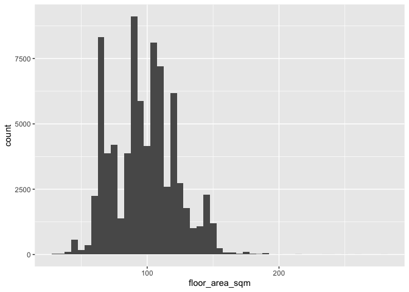
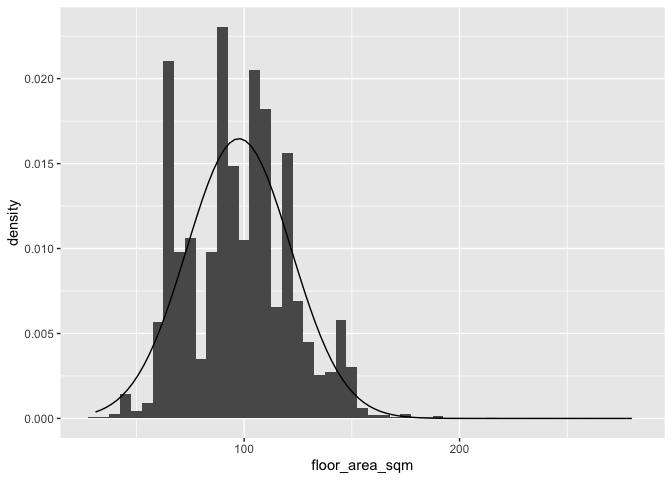
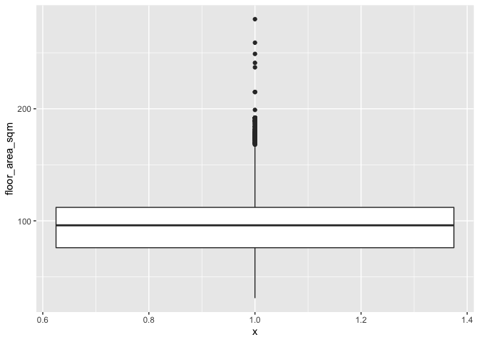
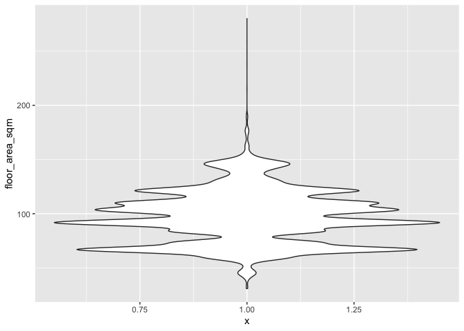
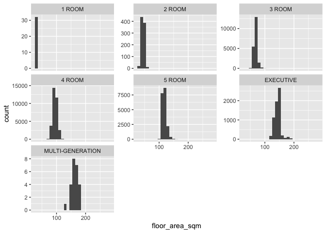
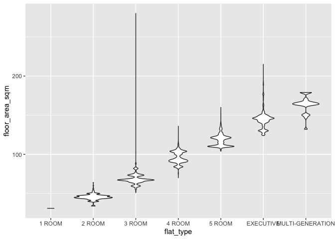

Week 3
================
Jeanette Choong
2/9/2020

``` r
library(tidyverse)
```

    ## ── Attaching packages ─────────────────────────────────────── tidyverse 1.3.0 ──

    ## ✓ ggplot2 3.2.1     ✓ purrr   0.3.3
    ## ✓ tibble  2.1.3     ✓ dplyr   0.8.4
    ## ✓ tidyr   1.0.2     ✓ stringr 1.4.0
    ## ✓ readr   1.3.1     ✓ forcats 0.4.0

    ## ── Conflicts ────────────────────────────────────────── tidyverse_conflicts() ──
    ## x dplyr::filter() masks stats::filter()
    ## x dplyr::lag()    masks stats::lag()

``` r
library(here)
```

    ## here() starts at /Users/jeancjw/Documents/SUTD/MUSPP/02.522 Urban Data & Methods II CUA/cua-jeanette

``` r
sales <- readRDS(here::here("data/sales.rds"))
```

``` r
# create own mode function because it doesn't exist in R
# from https://stackoverflow.com/a/25635740

manual_mode <- function(x, na.rm = FALSE) { # we don't use 'mode' as a function name because it already exists
  if(na.rm) {
    x = x[!is.na(x)]
  } 
  
  ux <- unique(x)
  return(ux[which.max(tabulate(match(x,ux)))])
  }
```

``` r
mean(sales$floor_area_sqm)
```

    ## [1] 97.58903

``` r
median(sales$floor_area_sqm)
```

    ## [1] 96

``` r
manual_mode(sales$floor_area_sqm)
```

    ## [1] 67

``` r
# Range
max(sales$floor_area_sqm)
```

    ## [1] 280

``` r
# Interquartile Range
IQR(sales$floor_area_sqm)
```

    ## [1] 36

``` r
# Standard Deviation
sd(sales$floor_area_sqm)
```

    ## [1] 24.22276

``` r
# Coefficient of variation
sd(sales$floor_area_sqm) / mean(sales$floor_area_sqm)
```

    ## [1] 0.2482119

``` r
library(e1071)

# Kurtosis and Skewness from the 'e1071' library
kurtosis(sales$floor_area_sqm)
```

    ## [1] -0.1450646

``` r
skewness(sales$floor_area_sqm)
```

    ## [1] 0.2770161

``` r
summary(sales$floor_area_sqm)
```

    ##    Min. 1st Qu.  Median    Mean 3rd Qu.    Max. 
    ##   31.00   76.00   96.00   97.59  112.00  280.00

``` r
library(skimr)
skim(sales$floor_area_sqm)
```

|                                                  |                        |
| :----------------------------------------------- | :--------------------- |
| Name                                             | sales$floor\_area\_sqm |
| Number of rows                                   | 79100                  |
| Number of columns                                | 1                      |
| \_\_\_\_\_\_\_\_\_\_\_\_\_\_\_\_\_\_\_\_\_\_\_   |                        |
| Column type frequency:                           |                        |
| numeric                                          | 1                      |
| \_\_\_\_\_\_\_\_\_\_\_\_\_\_\_\_\_\_\_\_\_\_\_\_ |                        |
| Group variables                                  | None                   |

Data summary

**Variable type: numeric**

| skim\_variable | n\_missing | complete\_rate |  mean |    sd | p0 | p25 | p50 | p75 | p100 | hist  |
| :------------- | ---------: | -------------: | ----: | ----: | -: | --: | --: | --: | ---: | :---- |
| data           |          0 |              1 | 97.59 | 24.22 | 31 |  76 |  96 | 112 |  280 | ▃▇▁▁▁ |

``` r
ggplot(sales, aes(x = floor_area_sqm)) + geom_histogram(binwidth = 5)
```

<!-- -->

``` r
ggplot(sales, aes(x = floor_area_sqm))+ geom_histogram(aes(y = ..density..), binwidth = 5) + stat_function(fun = dnorm, args = list(mean = mean(sales$floor_area_sqm), sd = sd(sales$floor_area_sqm)))
```

<!-- -->

``` r
sales %>% 
  filter(floor_area_sqm == "67") %>% 
  view()
```

# Can you think of specific contextual reasons why there might be so many flats with 66-70 sq meters of floor area?

``` r
# boxplot: a visual summary of the mean, IQR and outliers.
ggplot(sales, aes(x = 1, y = floor_area_sqm)) + geom_boxplot()
```

<!-- -->

``` r
ggplot(sales, aes(x = 1, y = floor_area_sqm)) + 
  geom_violin()
```

<!-- -->

``` r
# Visualizations are particularly useful to explore distributions within subgroups. 
```

``` r
ggplot(sales, aes(x = floor_area_sqm)) + 
  geom_histogram(binwidth = 10) +
  facet_wrap(~ flat_type, scales = "free_y")
```

<!-- -->

``` r
ggplot(sales, aes(x = flat_type, y = floor_area_sqm)) + 
  geom_violin()
```

<!-- -->
