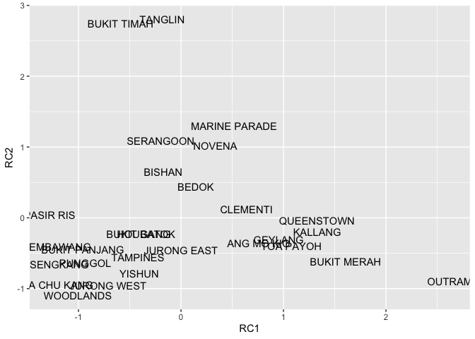
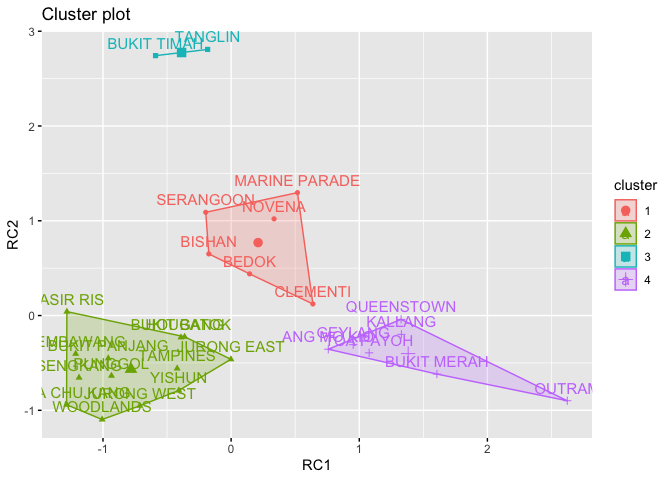
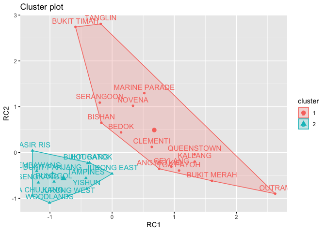
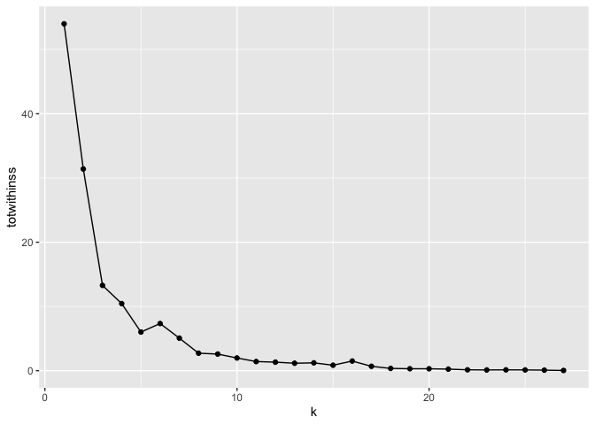
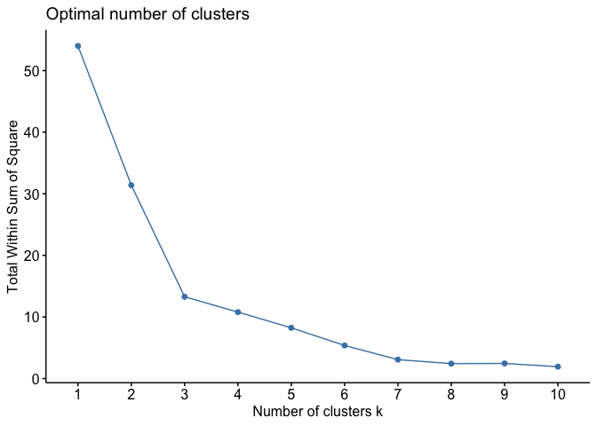
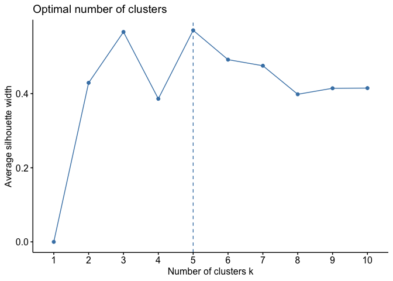
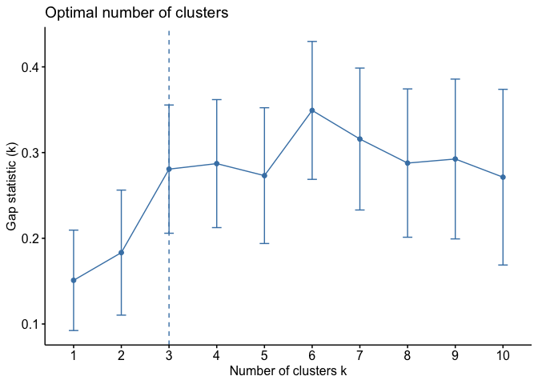

week9
================
Jeanette Choong
3/26/2020

``` r
library(tidyverse)
```

    ## ── Attaching packages ───────────────────────────────────────────── tidyverse 1.3.0 ──

    ## ✓ ggplot2 3.3.0     ✓ purrr   0.3.3
    ## ✓ tibble  2.1.3     ✓ dplyr   0.8.4
    ## ✓ tidyr   1.0.2     ✓ stringr 1.4.0
    ## ✓ readr   1.3.1     ✓ forcats 0.5.0

    ## ── Conflicts ──────────────────────────────────────────────── tidyverse_conflicts() ──
    ## x dplyr::filter() masks stats::filter()
    ## x dplyr::lag()    masks stats::lag()

``` r
library(here)
```

    ## here() starts at /Users/jeancjw/Documents/SUTD/MUSPP/02.522 Urban Data & Methods II CUA/cua-jeanette-c

``` r
library(psych)
```

    ## 
    ## Attaching package: 'psych'

    ## The following objects are masked from 'package:ggplot2':
    ## 
    ##     %+%, alpha

## 8.2 Partitional clustering

To explore how to perform clustering analysis in R, we will yet again
use our familiar dataset and initially just extract two factors using
factor analysis (through the `principal` funciton from the `psych`
package). As we can see in the resulting plot, we can distinguish a few
groups of planning areas that seem more closely related to each other
than to other planning areas in the country. Can we identify these
groups in a more automatic fashion?

``` r
planning_areas <- read_csv(here::here("data/planning_areas.csv"))
```

    ## Parsed with column specification:
    ## cols(
    ##   .default = col_double(),
    ##   planning_area = col_character()
    ## )

    ## See spec(...) for full column specifications.

``` r
fa <- planning_areas %>% 
  column_to_rownames(var="planning_area") %>% 
  select(starts_with("age"),
         starts_with("occupation"),
         starts_with("area"),
         starts_with("dwelling"),
         starts_with("hh")) %>% 
  principal(nfactors=2, rotate="varimax") %>% 
  pluck('scores') %>% 
  unclass() %>% 
  as_tibble(rownames="planning_area")

fa %>% 
  ggplot(aes(x=RC1, y=RC2))+ geom_text(aes(label=planning_area))
```

<!-- -->

To do so, we can use a partitional technique called kmeans. Partitional
techniques all follow the same steps:

  - The number of clusters is pre-assigned (by you, the researcher). We
    call this number of clusters k.
  - the goal is to divide our space into k clusters in a way that
    minimises a certain cost function. You are already familiar with
    cost functions: eg. in liner regression we are trying to minimize
    the difference between the estimated values and the observed values.
    There are different cost functions you can use. The most popular
    cost function is the total within-cluster distance or squared error,
    which is referred to as k means.

How does the algorithm work?

The algorithm starts out by distributing randomly k cluster centroids so
that they are as far away from each other as possible. Each observation
is assigned to the cluster centroid it is closest to. The cluster
centroids are re-calculated. Observations are re-assigned to new
clusters if they are now closer to a different centroid. Recalculate
cluster centroids, and repeat process until a stable solution is
reached. You can watch this process interactively on several websites. I
find this simple approach by Karanveer Mohan quite elegant, as well as
this interactive article by Naftali Harris.

We can run k-means clustering in R through the built-in kmeans function.
It takes two required arguments: the dataset to operate on and the
number of cluster to identify. As the solution for k-means might depend
on its initial starting points, we can run the algorithm multiple times
and take the best solution - this is done by setting the nstart
parameter. For now, let’s set the number of clusters to 4 and run the
algorithm 50
times.

``` r
cluster_data <- fa %>%  #remove planning_area column so we are left with only 'data'
  column_to_rownames(var="planning_area")

kmeans_clusters<- kmeans(cluster_data, centers=4, nstart=50)

kmeans_clusters
```

    ## K-means clustering with 4 clusters of sizes 6, 13, 2, 7
    ## 
    ## Cluster means:
    ##          RC1        RC2
    ## 1  0.2104976  0.7698051
    ## 2 -0.7817176 -0.5659694
    ## 3 -0.3865277  2.7751919
    ## 4  1.3817713 -0.4016589
    ## 
    ## Clustering vector:
    ##    ANG MO KIO         BEDOK        BISHAN   BUKIT BATOK   BUKIT MERAH 
    ##             4             1             1             2             4 
    ## BUKIT PANJANG   BUKIT TIMAH CHOA CHU KANG      CLEMENTI       GEYLANG 
    ##             2             3             2             1             4 
    ##       HOUGANG   JURONG EAST   JURONG WEST       KALLANG MARINE PARADE 
    ##             2             2             2             4             1 
    ##        NOVENA        OUTRAM     PASIR RIS       PUNGGOL    QUEENSTOWN 
    ##             1             4             2             2             4 
    ##     SEMBAWANG      SENGKANG     SERANGOON      TAMPINES       TANGLIN 
    ##             2             2             1             2             3 
    ##     TOA PAYOH     WOODLANDS        YISHUN 
    ##             4             2             2 
    ## 
    ## Within cluster sum of squares by cluster:
    ## [1] 1.59724144 3.45176404 0.08472948 2.74002273
    ##  (between_SS / total_SS =  85.4 %)
    ## 
    ## Available components:
    ## 
    ## [1] "cluster"      "centers"      "totss"        "withinss"     "tot.withinss"
    ## [6] "betweenss"    "size"         "iter"         "ifault"

Inspect the output of the clustering algorithm. We indeed find 4
clusters with 2, 6, 7, and 13 members respectively. We can visualize the
clustering results with the fviz\_cluster function from the factoextra
package and change the size of the labels with option
    cex.

``` r
library(factoextra)
```

    ## Welcome! Want to learn more? See two factoextra-related books at https://goo.gl/ve3WBa

``` r
library(cluster)
library(purrr)
fviz_cluster(kmeans_clusters, data=cluster_data)
```

<!-- -->

``` r
kmeans_clusters<- kmeans(cluster_data, centers=2, nstart=50)


fviz_cluster(kmeans_clusters, data=cluster_data)
```

<!-- -->

The previous exercise is a good illustration of picking the ‘right’
number of clusters. As you might have guessed, this again relates deeply
to the bias-variance tradeoff we have seen in class.

  - With a small number of clusters, we have more bias. At one extreme,
    when we only pick one cluster, all observations are assigned to it.
    The model cannot discriminate between different groups, i.e., our
    model is too “simple”.

  - With a large number of clusters, we have more variance. At the other
    extreme, when we pick as many clusters as we have observations, each
    observation is its own cluster, which it doesn’t share with any
    other observation. The model is “too good” at discriminating,
    putting everyone in their own group: our model is too “complex”.

We will see how to approach that in a later section but first we will
try to use a different clustering technique altogether.

## 8.3 Determining the optimal number of clusters

So far, we have set the number of clusters ourselves. In many cases, you
can have good theoretical or a-priori reason to set the number of
clusters ahead of time. In other cases, you have no notion about the
expected number of clusters yet. One of these techniques is called the
‘elbow’ method - similar to how we can decide how many factors to
extract in PCA.

As k-means clustering is trying to minimize a specific cost function
(the total within-cluster squared error), we can simply iterate through
all the potential number of clusters in our dataset and calculate this
statistic. We can then look for the ‘bend’ point: the point where adding
additional clusters doesn’t greatly add to minimizing our cost function
anymore. As with any repeated operation, we will use purrr to automate
the loop (specifically, the map\_dbl function).

``` r
library(dplyr)
calculate_totwithinss <- function(k, data = cluster_data, nstart=50) {
  kmeans(data, k, nstart) %>% 
    pluck('tot.withinss')
}

optimal_k <- tibble(k=1:27, 
                    totwithinss=map_dbl(1:27, calculate_totwithinss))

ggplot(optimal_k, aes(x=k, y=totwithinss)) + geom_line()+ geom_point()
```

<!-- -->

We can also do this with one of the convenience functions offered in the
factoextra package. How many clusters would you pick based on this plot?

``` r
fviz_nbclust(cluster_data, kmeans, method = "wss")
```

<!-- -->

There are additional methods too. Average silhouette is another
often-used approach. Conceptually, the silhouette is a measure
reflecting how well an individual point fits within its cluster (this
Stackoverflow answer provides a more detailed description). The average
silhouette simply takes the average of the silhouettes of all points.
Again, factoextra makes plotting this quite easy.

``` r
fviz_nbclust(cluster_data, kmeans, method = "silhouette")
```

<!-- -->

What number of clusters would you pick based on this method?

Finally, there is also the gap statistic. This statistic is calculated
based on a comparison of our cluster result with a null distribution
that assumes no clustering. We will cover the conceptual logic behind
this when we discuss spatial clustering next week so for now we will
just look at what this metric indicates the best k would be (read the
original paper by Tibshirani, Walther and Hastie (2000) if you’re
interested). We need an additional library (cluster) to calculate this
statistic.

``` r
cluster::clusGap(cluster_data, FUN = kmeans, nstart = 50, K.max = 10, B = 50) %>% 
  fviz_gap_stat()
```

<!-- -->
